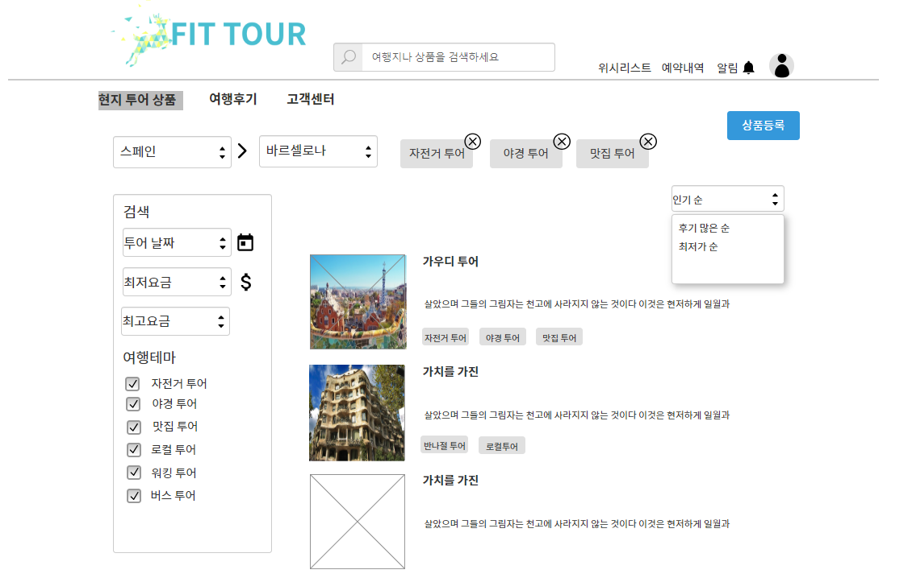
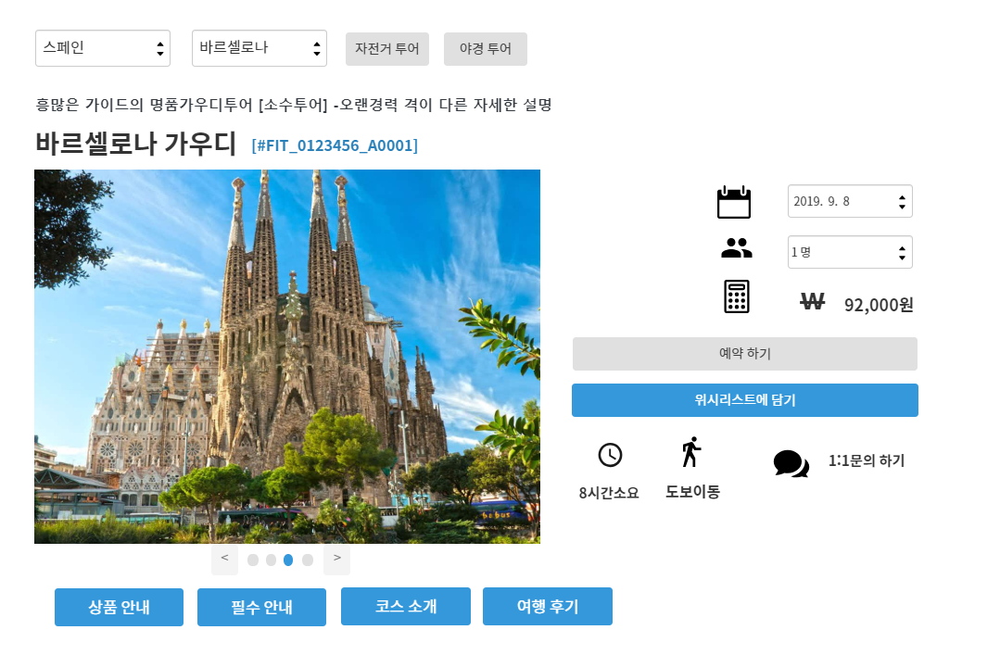
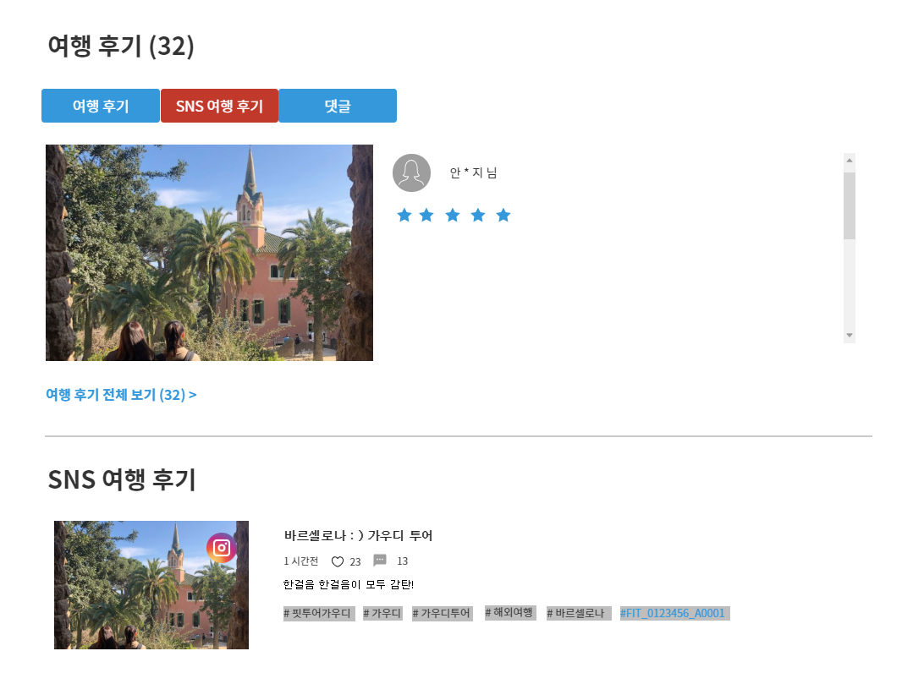
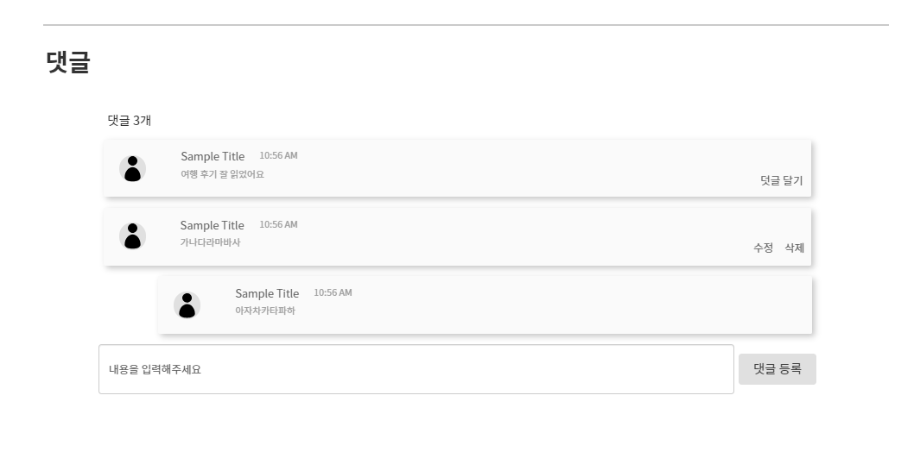

# UC02 - 현지 투어 상품조회  (Local Tour Product inquiry)

현지 투어 상품을 조건에 따라 현지 투어상품 목록을조회하고 현지투어 상품의 상세조회(상품 안내, 필수안내, 코스소개, 여행후기)를 할 수 있는 유스케이스이다.
## 주 액터(Primary Actor)
- 비회원
- 회원
- 관리자
## 보조 액터(Secondary Actor)
 - 구글맵 api, 트위터 search api, 인스타그램 search api, 네이버블로그 serach api
## 사전 조건(Preconditions)
- 없음
## 종료 조건(Postconditions)

- 현지 투어 상품을 조회하였다.
- 관리자와 채팅하였다.
- 위시리스트 담기하였다.
- 현지 투어 상품을 예약하였다.

## 시나리오(Flow of Evnets)

### 현지 투어 상품 목록 조회하기

1. 액터는 현지 투어상품을 조회할 국가와 나라를 선택한다.
  - (국가, 나라)가 비어 있다면,
  - 시스템은 모든 국가,나라의 상품을 출력한다.
2. 액터는 현지 투어상품을 조회할 투어 날짜와 최저요금과 최고 요금을 선택한다.
  - 투어 날짜가 비어 있다면, 시스템은 모든 날짜의 현지 투어상품을 출력한다.
  - 최저요금이 비어있고 최대요금이 입력되었다면,
    시스템은 최대요금이하의 모든 현지 투어상품을 출력한다.
  - 최저요금이 입력되어있고 최고요금이 비어있다면,
    시스템은 입력된 최소요금이상의 모든 현지 투어상품을 출력한다.
  - 최저요금,최대요금이 비어있다면,
    시스템은 모든 현지 투어상품을 출력한다.
3. 액터는 여행테마의 채크박스 항목을 0개이상 채크한다.
   시스템은 채크박스를 채크한 항목의 모든 현지 투어상품들을 출력한다.
4. 액터는 현지 투어상품을 정렬할 방식(요금낮은순,후기많은순,인기순)을 선택한다.
   - 시스템은 정렬 방식에따라 현지 투어상품을 출력한다.

### 현지 투어 상품 상세 조회하기

1. 액터는 투어 현지 투어상품을 클릭한다.
- 시스템은 투어 현지 투어상세내용(상품명, 상품번호(태그), 상품사진, 소제목, 상품 안내, 필수안내,    코스소개, 소요시간, 이동수단,여행후기)을 출력한다.
   - 보조액터(인스타그램,트위터)는 상품번호(태그)명이 인스타그램,트위터,네이버블로그에 태그로 달린 작성글을 가져와 SNS여행후기 출력한다.
   - 보조액터(구글맵 api)는 만나는장소를 출력한다.
2. 엑터는 상품 안내 버튼을 클릭한다.
- 시스템은 상품 안내 태그로 이동한다.
3. 엑터는 필수 안내 버튼을 클릭한다.
- 시스템은 필수 안내 태그로 이동한다.
4. 액터는 코스 소개 버튼을 클릭한다.
- 시스템은 코스 소개 태그로 이동한다.
5. 액터는 여행 후기 버튼을 클릭한다.
- 시스템은 여행 후기 태그로 이동한다.
6. 액터는 SNS여행후기 또는 댓글 버튼을 클릭한다.
- 시스템은 SNS여행후기 또는 댓글을 출력한다.

## UI 프로토타입

###

### 

### 

### 

### 

### 

