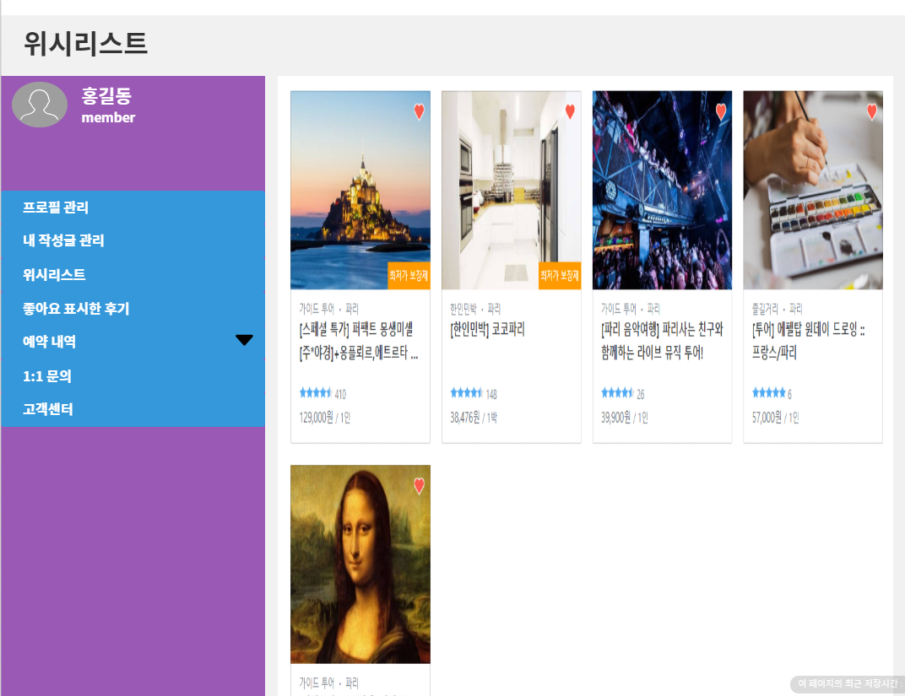

# UC14 - 현지 투어 상품조회(Local Tour Product inquiry)

회원이나 관리자가 현지 투어 상품을 위시리스트에 추가,삭제,조회 할 수 있는 유스케이스이다.
## 주 액터(Primary Actor)
- 회원
- 관리자
## 보조 액터(Secondary Actor)

## 사전 조건(Preconditions)
- 회원 또는 관리자로 로그인 되어 있다.
## 종료 조건(Postconditions)
- 위시리스트를 조회하였다.
- 위시리스트에 현지 투어 상품을 추가하였다.
- 위시리스트에 현지 투어 상품을 삭제 하였다.

## 시나리오(Flow of Evnets)

### 위시 리스트 조회하기
1. 액터는 웹페이지 오른쪽상단에 위시리스트를 클릭한다.
- 시스템은 액터가 위시리스트에 추가한 현지 투어 상품들을 출력한다.

### 위시리스트에 현지 투어 상품 추가하기
1. 액터는 하트 버튼을 클릭한다.
- 시스템은 하트 버튼의 색을 채운다.
- 시스템은 위시리스트에 담았다는 메세지와 위시리스트 바로가기버튼과 확인버튼을 팝업창으로 띄운다.
- 시스템은 회원 로그인이 되어 있지 않다면 로그인이 되어있어야 됨을 알린다.
2. 액터는 위시리스트 바로기기 버튼을 클릭한다.
- 시스템은 '위시 리스트 조회하기' 유스케이스의 2번으로 간다.
3. 액터는 확인버튼을 클릭한다.
- 시스템은 '현지 투어 상품조회' 유스케이스로 간다.

### 위시리스트에 현지 투어 상품 삭제하기

1. 액터는 웹페이지 오른쪽상단에 위시리스트를 클릭한다.
- 시스템은 액터가 위시리스트에 추가한 현지 투어 상품들을 출력한다
2. 액터는 삭제할 현지 투어상품의 오른쪽상단 하트 버튼을 클릭한다.
- 시스템은 하트버튼을 클릭한 해당 현지 투어상품을 삭제한 후 '위시리스트 조회하기' 유스케이스의 2번으로 간다.

### 예외 흐름(Exception Flows)  
1. 해당 상품이 없으면, 
- 시스템은 해당 상품이 없음을 알린다.

## UI 프로토타입

###

